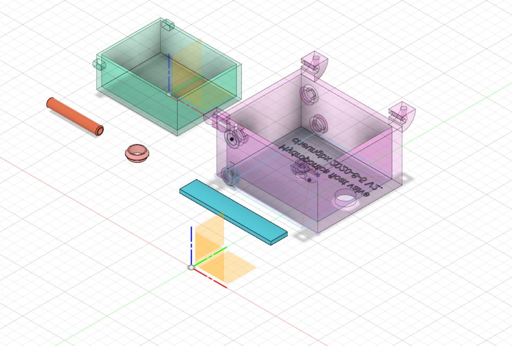

# float-valve-V2  - for auto nutrient level control for passive hydroponics
#
# Designed by cheungbx (c) 2020.08.19 - free for personal use.
# Use on commercial and resellable products are not authorized.

click the picture below to view the demonstration and DIY video.

# Float valve is a water level controller used in Passive Hydroponics systems.
# Install a big nutrient tank that can supply nutrients for a month for your plans.
# Connect a pipe form the nutrient tank to the float valve.
# Place the float value at the base of the growth tank for plants or vegtable.
# The float valve will control water level not to exceed 20 mm. This is to avoid drowning the roots and keep enough space above water for airing the roots for healthy growth.
# When the nutrient level drops below 20 mm, the float valve will fall allowing nutrient to flow from the nutrient tank into the growth tank nurishing the plants.
# No electricity nor pumps required in this passive Hydroponics arrangement.
# The only additional ingrediant you need is either natural sunlight or indoor grow lamps that could be LED grow lights.
# The following original design files are included for you to custimize the design for your own need.
#
# *.f3d file is the archive file exported from Autodesk Fusion 360.
# *..stl is the common 3D design format.
# *.gcode is the sliced file created by Ultimaker Cura for use in Ender 3 Pro 3D printer only.
#
# 3D printing instructions for Ender3 Pro : Take defaults for PLA material with these adjustments: Infill 40%,   Support off.
3
# The inlet pipe printed may not be durable enough. You may need to replace that with a 4.7mm ouside diameter (3mm inside diameter) platic balloon stick.
# more instructions in this youtube video:

https://youtu.be/t1FxCKXK-P4
